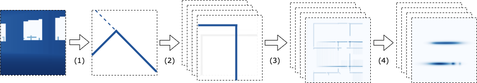
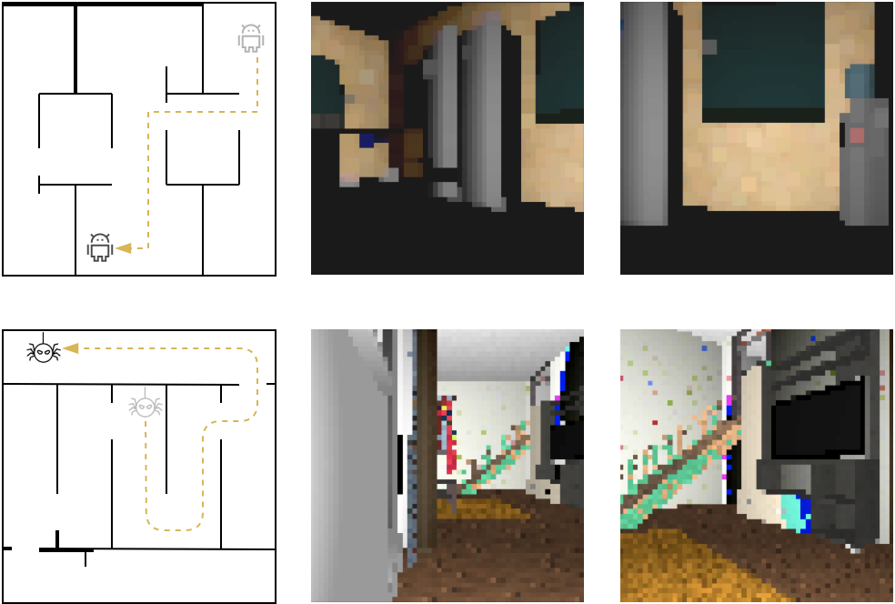

# Multiplicative Gaussian Particle Filter
[](https://opensource.org/licenses/MIT)
[](http://hits.dwyl.com/suxuann/mgpf)


TensorFlow implementation of Multiplicative Gaussian Particle Filter. We apply MGPF on robot localization as a proof-of-concept.

Xuan Su, Wee Sun Lee, and Zhen Zhang: Multiplicative Gaussian Particle Filter. 
The 23rd International Conference on Artificial Intelligence and Statistics (AISTATS 2020).
https://arxiv.org/pdf/2003.00218.pdf

[](https://www.python.org/)
[](https://GitHub.com/Naereen/)

### Pipeline for the Observation Function


Pipeline for extracting Gaussians using depth image. (1): simulated laser scan, followed by edge
detection; (2): rotation; (3): convolution over wall map; (4): Gaussian extraction.

### Requirements

Python 2.7, Tensorflow 1.5.0

Additional packages are specified in the yml file, to be installed using conda.
Configurations in the yml file need to be set properly before installation.
```
mgpf-env.yml 
``` 

### Dataset

The dataset for robot localization experiments is available at:

```
https://drive.google.com/open?id=1v7m1B8H5N7avcFmdrDl7DtsMbPLcHamk
``` 

The folder contains only one file: ```wallsonly_test.tfrecords```.
Download and save into the ```data``` folder. 



### Evaluation

To produce experimental results in the paper, run e.g.
```
python evaluate_aistats.py -c ./configs/eval-tracking.conf
```
replacing the configuration file as appropriate. 

Results used in the paper are also included in their respective folders.

### Acknowledgements

Our code is written largely based on a previous framework, the particle filter network (PF-Net): https://github.com/AdaCompNUS/pfnet.
Credits to Peter Karkus.  

### Contact

Xuan Su <suxuan (at) comp.nus.edu.sg>
